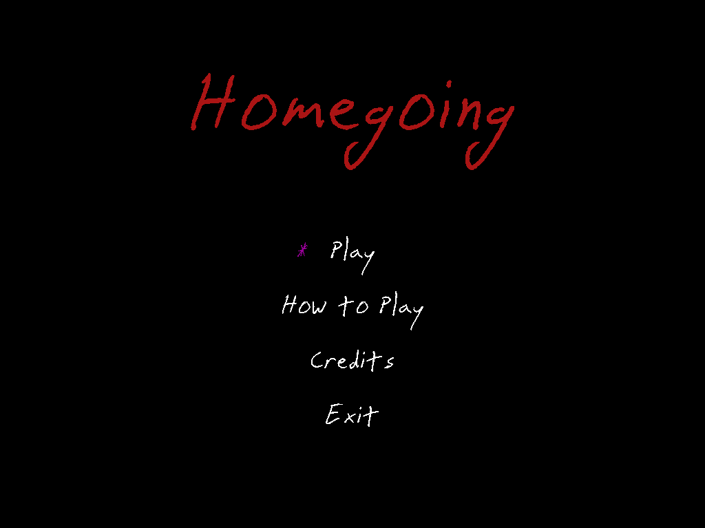
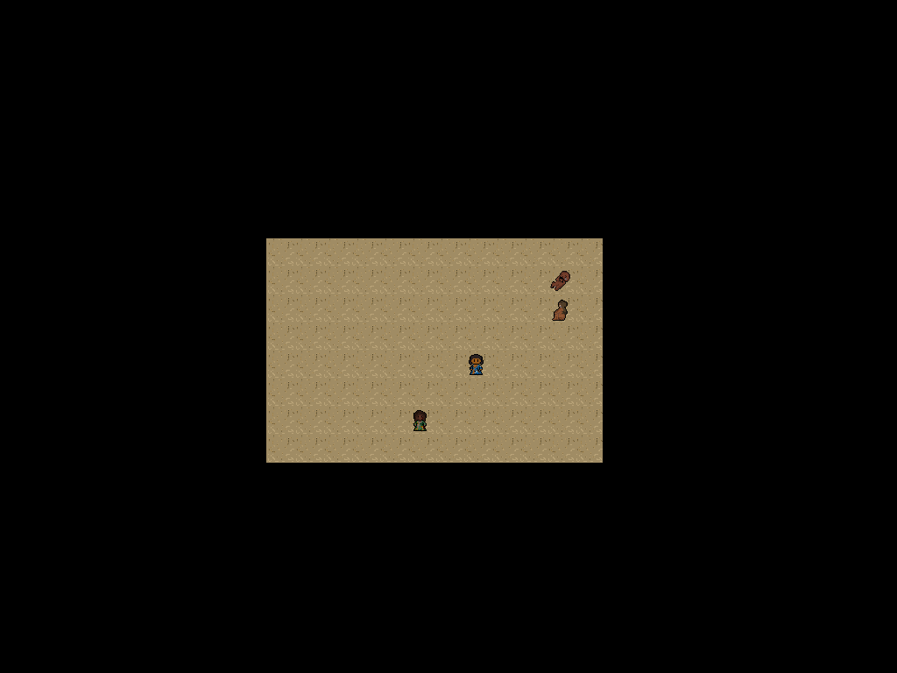
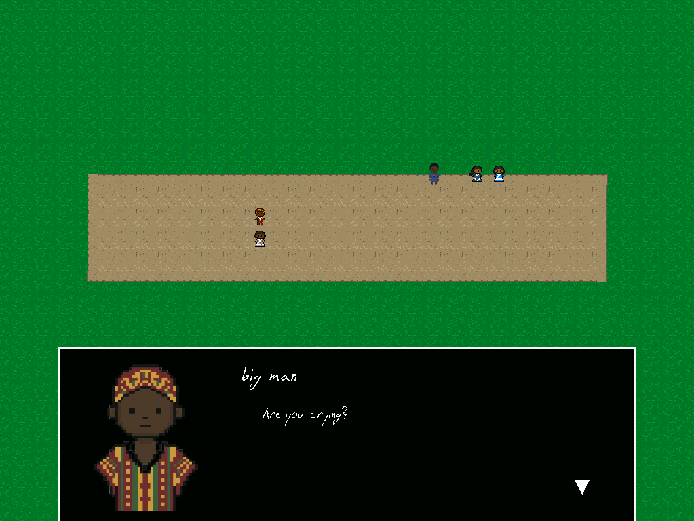

# Homegoing Game
*A narrative adaptation of the novel **Homegoing** by Yaa Gyasi*

The game is about 10-30 minutes long, depending on route and your speed.

## About the Project
This is a narrative-driven interactive game inspired by the Esi chapter of ***Homegoing*** by Yaa Gyasi.

The player takes on the role of Esi and experiences key moments from her story through dialogue choices and movement-based exploration. The game explores themes of generational trauma, gender roles, the loss of home, and the illusion of choice in oppressive systems.

This project is a non-commercial educational adaptation created for academic purposes.

## Content Warning
This game contains references to:
- Enslavement
- Sexual violence (implied)
- Physical abuse
- Death
- Themes of generational trauma

There are no graphic scenes in the game. Sensitive events are handled through textual implication.

### Photosensitivity Warning
This game contains occasional camera shake and visual transition effects.

## How to Play
You do not use your mouse at all in this game.

**Controls**
- Move: `WASD` or `Arrow Keys`
- Interact / Advance dialogue: `Spacebar` or `Enter`

This game includes branching dialogue choices. Some decisions affect later conversations and narrative framing.

Replay is encouraged.

## Installation / Running the Game
1. Go to the **Releases** sections of this repository
2. Download the latest `.zip` file
3. Extract the `.zip` file to a folder on your computer
4. Open the extracted folder
5. Double-click the `main.exe` file to run the game

No additional installation is required. The executable is generated with pyinstaller.

## Credits
**Original Novel:** *Homegoing* by Yaa Gyasi\
**Programmers:** Mihir and Theodor\
**Artists:** Abdulrahman and Yazan\
**Writer:** Jonas

**Font:** Snake

## Gameplay Screenshots
### Main Menu

### Dungeon Scene

### Bucket Scene
